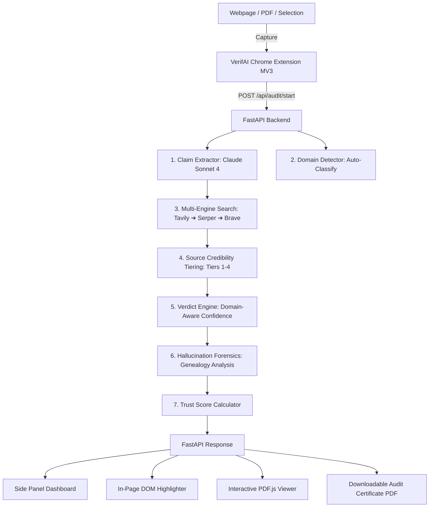

# 🔍 VerifAI — Real-Time Hallucination Audit Trail & In-Page Highlighter

<div align="center">

[](https://fastapi.tiangolo.com)
[](https://www.python.org)
[](https://developer.chrome.com/docs/extensions/mv3/intro/)
[](https://www.anthropic.com)
[](LICENSE)

**Verify any AI-generated text or PDF document in real time.**  
VerifAI extracts atomic factual claims, searches the open web across a multi-engine fallback chain, scores source credibility, diagnoses hallucination root-causes, and **directly paints color-coded verification highlights onto active webpages and PDF documents**.

[Features](#-key-features) • [Architecture](#-architecture) • [Quick Start](#-quick-start) • [How to Use](#-how-to-use) • [API Reference](#-api-reference) • [Trust Score Model](#-trust-score-formula)

</div>

---

## 🌟 Key Features

- **⚡ Direct In-Page Highlighting**: Color-codes text directly on active webpages (ChatGPT, Gemini, Claude, Wikipedia, news articles) and inside PDF documents:
  - 🔴 **Hallucinations**: High-contrast red highlight with pulsing attention indicator and contradiction reasoning.
  - 🟡 **Unverified**: Amber highlight when claims cannot be corroborated by authoritative sources.
  - 🟢 **Verified**: Emerald green highlight with source citation link.
- **📄 Direct In-Page PDF Reader**: Drag-and-drop any `.pdf` or scan live PDF tabs. Powered by an embedded `PDF.js` rendering engine with an interactive textLayer overlay for direct on-page highlighting.
- **🔬 Hallucination Forensics & Genealogy**: Goes beyond binary true/false to diagnose **how and why** the AI hallucinated (*attribute swap, amalgamation, temporal drift, domain confusion, pure confabulation*).
- **🛡️ Domain-Aware Verification**: Automatically detects the subject domain (*Healthcare, Legal, Finance, Education, News, General*) and applies domain-specific rigor and penalty multipliers for high-stakes assertions.
- **🌐 3-Tier Multi-Engine Search Fallback**: Cascades search queries across **Tavily → Serper (Google) → Brave Search** with local disk caching.
- **📊 Exportable Audit Certificates**: Downloads publication-ready PDF verification certificates with executive summaries and annotated document text.

---

## 🏗️ Architecture



---

## 📁 Repository Layout

```
VerifAi/
├── backend/                      # FastAPI Python Backend
│   ├── main.py                   # Server entrypoint & middleware
│   ├── config.py                 # Environment & model settings
│   ├── requirements.txt          # Python dependencies
│   ├── routers/
│   │   └── audit.py              # REST API endpoints (/start, /upload-pdf, /results, etc.)
│   ├── services/
│   │   ├── claim_extractor.py    # Atomic factual claim extraction via Claude
│   │   ├── domain_detector.py    # Multi-domain categorization & penalty rules
│   │   ├── web_verifier.py       # Tavily ➔ Serper ➔ Brave fallback & disk cache
│   │   ├── verdict_engine.py     # Domain-aware confidence caps & verdicts
│   │   ├── genealogy.py          # Hallucination taxonomy & mutation diagnosis
│   │   ├── report_generator.py   # Trust scoring & PDF report generator
│   │   ├── pipeline.py           # Async parallel verification pipeline
│   │   └── llm_client.py         # Anthropic API client wrapper
│   ├── models/
│   │   └── schemas.py            # Pydantic data schemas & enums
│   ├── db/
│   │   └── database.py           # SQLite database persistence layer
│   └── data/
│       ├── samples.py            # Pre-configured demo documents
│       └── mock_fixtures.py      # Offline mock data for instant testing
│
└── extension/                    # Chrome Extension (Manifest V3)
    ├── manifest.json             # Extension manifest & permissions
    ├── background.js             # Service worker, message router & tab injector
    ├── content.js                # DOM text extractor & multi-node in-page highlighter
    ├── highlight.css             # In-page highlight animations & floating tooltips
    ├── sidebar.html              # Side panel UI layout
    ├── sidebar.css               # Modern dark-mode side panel theme
    ├── sidebar.js                # Real-time gauge, live feed, claim cards & tabs
    ├── pdf_viewer.html           # In-tab PDF.js canvas reader with textLayer
    ├── pdf_viewer.css            # PDF viewer & on-canvas highlight styles
    ├── pdf_viewer.js             # PDF page rendering & textLayer highlight linker
    ├── pdf.min.js                # Mozilla PDF.js core library
    ├── pdf.worker.min.js         # Mozilla PDF.js worker
    └── icons/                    # Extension action icons
```

---

## 🚀 Quick Start

### 1. Prerequisites
- **Python 3.11+** (3.12 or 3.13 recommended)
- **Google Chrome** (or Chromium-based browser like Brave, Edge)
- Anthropic / Search API Keys *(optional — full offline Mock Mode available)*

---

### 2. Backend Setup

```bash
# 1. Clone the repository
git clone https://github.com/Aadityasingh0709/VerifAi.git
cd VerifAi

# 2. Create and activate a Python virtual environment
# On Windows (PowerShell):
python -m venv .venv
.venv\Scripts\Activate.ps1

# On macOS / Linux:
python3 -m venv .venv
source .venv/bin/activate

# 3. Install dependencies
pip install -r backend/requirements.txt

# 4. Configure environment variables
cp .env.example .env
```

Edit `.env` with your API keys:
```env
ANTHROPIC_API_KEY=sk-ant-api03-...
TAVILY_API_KEY=tvly-...
SERPER_API_KEY=...
BRAVE_API_KEY=...
CORS_ORIGINS=*
MOCK_MODE=         # Leave blank for live verification; set to 1 for offline demo mode
```

Start the FastAPI server:
```bash
uvicorn backend.main:app --host 127.0.0.1 --port 8000 --reload
```

Verify backend health at: [http://127.0.0.1:8000/healthz](http://127.0.0.1:8000/healthz) — returns `{"ok": true}`.

---

### 3. Load the Chrome Extension

1. Open Google Chrome and go to `chrome://extensions`.
2. Turn on **Developer mode** (top right toggle).
3. Click **Load unpacked** (top left).
4. Select the `extension/` folder in this repository.
5. Click the puzzle icon in Chrome and **Pin VerifAI** to your browser toolbar.

---

## 📖 How to Use

### 🔍 1. Scan Any Webpage
- Navigate to any AI chat (ChatGPT, Gemini, Claude, Perplexity) or article.
- Click the **VerifAI** toolbar icon to open the side panel.
- Click **"Scan This Page"**.
- VerifAI extracts the text, runs the audit pipeline, and **automatically highlights every verified and hallucinated sentence directly on the webpage**.
- Hover over any highlight on the page to see the floating forensic tooltip!

### 📄 2. Scan & Highlight PDF Documents
- **Drag & Drop**: Drop any `.pdf` file directly onto the drop zone in the side panel.
- **Scan PDF Tab**: On any open PDF tab in Chrome, click **"Scan This Page"**.
- **Interactive PDF Viewer**: Click **"📄 Open Full Highlighted Reader"** to open the document in VerifAI's in-page PDF.js reader with all color highlights rendered right over the PDF lines.

### ✂️ 3. Verify Selected Text
- Select any text on any page → Right-click → Select **"Verify with VerifAI"**.

### 📋 4. Paste & Verify
- Open sidebar → Click **"Paste & Verify"** → Paste text → Click **"Run Audit"**.

---

## 🔬 Forensic Genealogy Taxonomy

When VerifAI detects a hallucinated claim, it classifies the error using a 5-type taxonomy:

| Forensic Type | Description | Real-World Example |
|---|---|---|
| **Attribute Swap** | The AI assigns a real attribute/action to the wrong person, date, or entity. | *"Marie Antoinette said 'Let them eat cake'"* (Quote is from Rousseau). |
| **Amalgamation** | Merges multiple unrelated facts into a single false statement. | *"Einstein published a 1935 paper on Quantum AI"* (Merged 1935 EPR paper with modern AI). |
| **Temporal Drift** | An outdated fact presented as current truth. | *"Aspirin reduces heart attack risk by 44% in adults 50+"* (Outdated 1989 trial). |
| **Domain Confusion** | Applies a rule or definition from one domain incorrectly to another. | Confusing C language compile-time `sizeof` with a runtime function. |
| **Pure Confabulation** | Completely fabricated entities, awards, or specifications. | Inventing a non-existent *"Google Neptune API"* or future Nobel prize winner. |

---

## 📊 Trust Score Formula

The trust score ($0 - 100$) quantifies the factual integrity of the audited content:

$$\text{Raw Score} = \left( \frac{\sum \text{Weight}(\text{Verdict}) \times \frac{\text{Confidence}}{100}}{\text{Total Claims}} \right) \times 100$$

$$\text{Trust Score} = \max\left(0, \text{Raw Score} - (\text{HighStakesHallucinations} \times 10 \times \text{DomainPenalty})\right)$$

### Verdict Weights:
- `VERIFIED`: **1.0**
- `UNVERIFIED`: **0.4**
- `HALLUCINATED`: **0.0**

### Domain Penalty Multipliers:
- **Healthcare & Legal**: `2.0×` *(strictest standard)*
- **Finance**: `1.5×`
- **General / Education / News**: `1.0×`

---

## 📡 API Reference

| Method | Endpoint | Description |
|---|---|---|
| `POST` | `/api/audit/start` | Starts an audit from raw text. Returns `audit_id`. |
| `POST` | `/api/audit/upload-pdf` | Uploads a `.pdf` file, extracts text, and initiates audit. |
| `GET` | `/api/audit/{id}/status` | Polls live progress, current stage, and partial claims. |
| `GET` | `/api/audit/{id}/results` | Returns full completed audit result, trust score, and genealogy. |
| `GET` | `/api/audit/{id}/report.pdf` | Generates and downloads an annotated PDF audit certificate. |
| `GET` | `/api/audit/samples/list` | Returns list of preset demo documents for testing. |
| `GET` | `/api/audit/samples/{id}` | Fetches a specific sample document. |
| `GET` | `/healthz` | Health check endpoint. |

---

## 🛠️ Offline Mock Mode

To demo or develop without active API keys:
1. Set `MOCK_MODE=1` in your `.env` file.
2. Launch the backend server.
3. Use the pre-loaded sample documents (French Revolution, Aspirin, James Webb Space Telescope) in the extension sidebar for instant, deterministic results.

---

## 📄 License

This project is licensed under the [MIT License](LICENSE).
